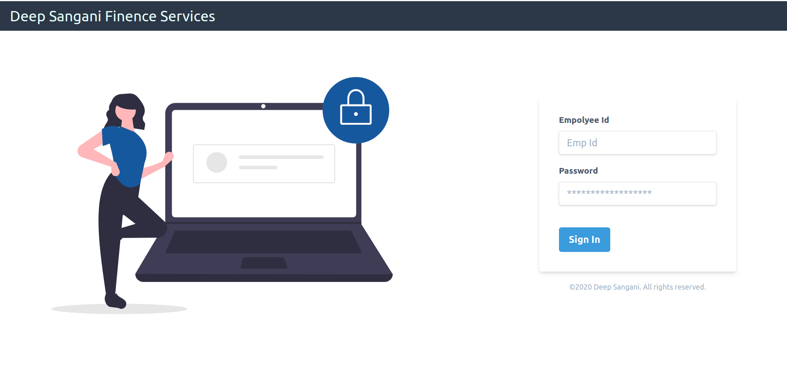
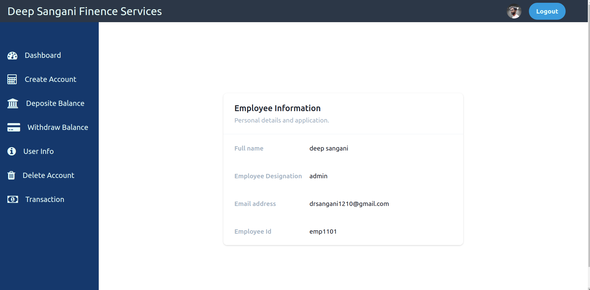

# JAVA BANK APP WITH JSP AND SERVLET WITH TELWIND.CSS

<!-- ## [lIVE DEMO](https://realtime-pizza.tk/) -->
</br>


### LOGIN PAGE</br>



</br></br>

### HOME PAGE🚀🚀</br>




>## create database "bank" in mysql databse
</br>

>create emp table in mysql database

```sql
CREATE TABLE `emp` (
  `id` int NOT NULL AUTO_INCREMENT,
  `name` varchar(20) DEFAULT NULL,
  `password` varchar(50) DEFAULT NULL,
  `email` varchar(50) DEFAULT NULL,
  `designation` varchar(50) DEFAULT NULL,
  `empid` varchar(50) DEFAULT NULL,
  PRIMARY KEY (`id`)
);
```

>create customer table in mysql database

```sql
CREATE TABLE `customer` (
  `first_name` varchar(50) DEFAULT NULL,
  `last_name` varchar(50) DEFAULT NULL,
  `email_address` varchar(50) DEFAULT NULL,
  `street_address` varchar(50) DEFAULT NULL,
  `city` varchar(50) DEFAULT NULL,
  `state` varchar(50) DEFAULT NULL,
  `account_type` varchar(50) DEFAULT NULL,
  `pan_card` varchar(50) DEFAULT NULL,
  `mobile_no` varchar(50) DEFAULT NULL,
  `aadhar_card` varchar(50) DEFAULT NULL,
  `postal_code` varchar(50) DEFAULT NULL,
  `acc_no` varchar(100) NOT NULL,
  `balance` double DEFAULT '0',
  PRIMARY KEY (`acc_no`)
);
```
>create transaction table in mysql database

```sql
CREATE TABLE `transaction` (
  `id` int NOT NULL AUTO_INCREMENT,
  `date` varchar(50) DEFAULT NULL,
  `acc_no` varchar(50) NOT NULL,
  `deposit` double DEFAULT '0',
  `withdraw` double DEFAULT '0',
  `particulers` varchar(50) DEFAULT NULL,
  `balance` double DEFAULT '0',
  PRIMARY KEY (`id`),
  KEY `acc_no` (`acc_no`)
);
```

